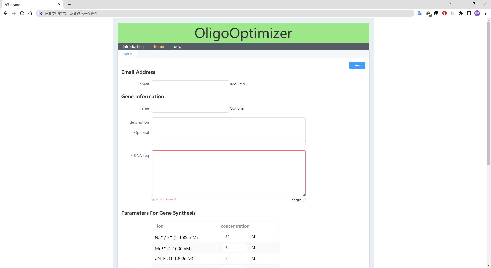

## oligoOptimizer

The webserver OligoOptimizer is developed for oligonucleotide assembling of gene synthesis. It can design oligonucleotide sets for gene synthesis by polymerase chain reaction (PCR). It offers much flexibility with no constraints on gene to be synthesized. Based on an integrated algorithm, the oligodeoxynucleotides with homologous melting temperature necessary for two-step assembly PCR-based synthesis of the desired gene are finially outputted. Furthermore, it can analyse the mismatches between oligonucleotides based on thermodynamic processes and provide the concentration of potential mismatches. To output gapless oligonucleotide sets for PCR-based synthesis, users can select the item 'Gapless' in the 'Result Type' options. When selecting 'Gapless' and tuning the parameters in 'Parameters For Gene Synthesis' options, the outputted oligonucleotide sets also can be used for LCR-based gene synthesis.

## Getting Started
[www.oligotmoptim.com](http://www.oligotmoptim.com/)

## Operating environment
- Django 3+
- MySQL 5.7+
- Python 3.7+

## result

~~~
    (F_Primer)
    ---------     (Fi)
    ------------------ ------------------ ------------------ ------------------ 
             ------------------ ------------------ ------------------- ------------------
             (Ri)                                                               ---------
                                                                                (R_Primer)
~~~

